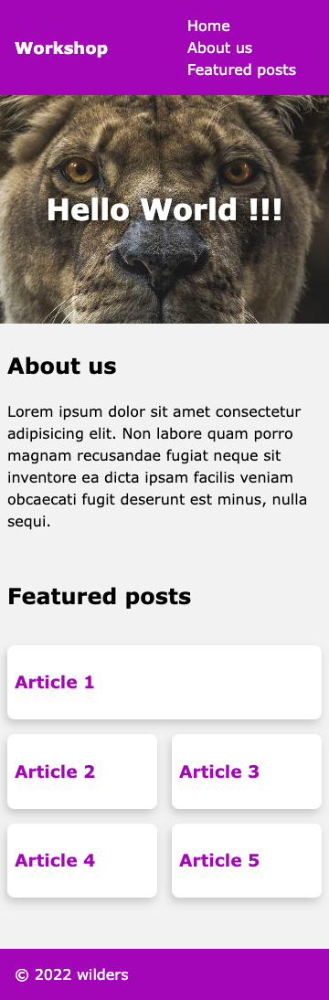
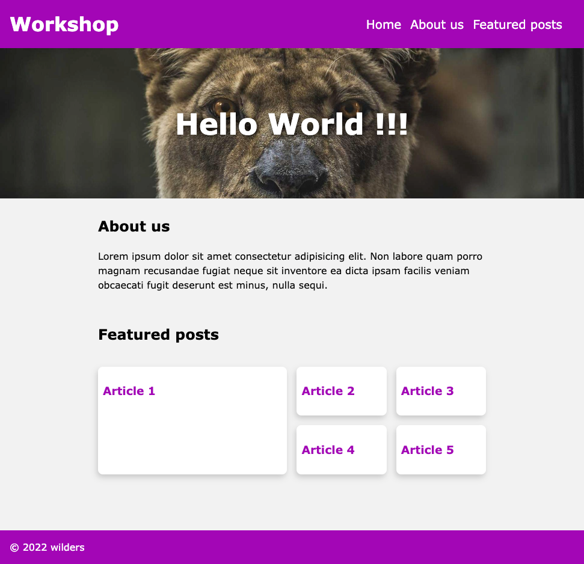

# Responsive design workshop 

**The objectives of this workshop**:  
• improve the HTML integration with Flex and Grid properties.  
• make the whole thing responsive.
{: .alert-info}


## Initialisation

This workshop is the second part of the [HTML Basics workshop](https://wildcodeschool.github.io/workshop-html-css-basics/).
So you can start from your previous work or [download this version](https://github.com/WildCodeSchool/workshop-html-css-responsive/archive/refs/heads/master.zip) if you are not sure of what you did.


## Layout of your website
You will have to create a basic responsive website following the layout below (**do not try** to be pixel perfect, this image is just a guide). 

<a href="./mobile_layout.png" target="_blank">Open in new tab <i class="bi bi-box-arrow-up-right"></i></a>  
 

*(The screenshot has been made at 360px viewport width, it is a standard smartphone size).*


### Navbar

- Now for this mobile version, the HTML structure of the navigation bar has not changed but its presentation is different. Reproduce this using **flexbox**.

Reminder:  
[Video - Flexbox in 100s](https://www.youtube.com/watch?v=K74l26pE4YA)  
[Flexbox basics Cheatsheet](https://jonitrythall.com/content/images/flexboxsheet.pdf)
{: .alert-info}

### Header

- The `<header>` section could be improved too by using **flexbox** to center horizontally but also vertically the `<h1>`.

### Featured posts section

Unlike the `About Us` section which doesn't need to be modified here, the `Featured posts` section requires you to add a css class to it.
- Add the `featured-posts` CSS class to this section.
- Add a fifth article in the HTML structure.
- Using CSS grid, create a 2 columns layout. According to the template, the first article will take 2 cells in the grid, others only one.

> Reminder: [CSS Grid basics in 5 minutes](https://www.freecodecamp.org/news/learn-css-grid-in-5-minutes-f582e87b1228).  

> Tips: the first article can be targeted with the `:first-of-type` css selector.

## Make it responsive

Add media queries and use CSS functions to obtain the responsive layout below at 1200px. 
> You can use a breakpoint at 768px in your media queries (which is a landscape breakpoint of some tablets).

<a href="./desktop_layout.png" target="_blank">Open in new tab <i class="bi bi-box-arrow-up-right"></i></a> 
 

*(The screenshot has been made at 970px viewport width.)*

- Make the navbar responsive.
- Use `clamp()` function to make your `<h1>` readable for each size.
- Modify the Grid template to adapt the products horizontally over 4 columns layout but still keep a largest "Article 1" over 2 columns and 2 rows.

> Tips: add this code snippet to your css so that the `<h2>` is positioned in a friendly way 😏 .
> ```css
> section.featured-posts h2 {
>    grid-column: 1 / -1;
> }
> ```

- Add a `filter: drop-shadow` propertie on the `<h1>` of the `<header>` but only for screen media to make sure this effect is excluded from printers context.
